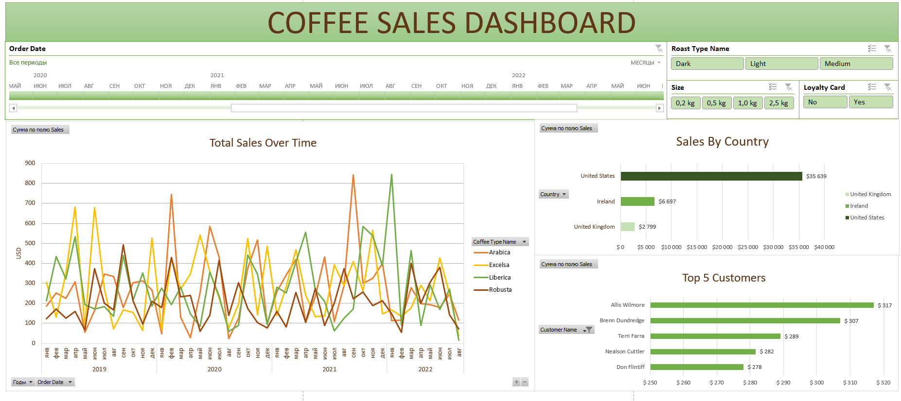

# Sales Performance Dashboard | BI-проект в Excel

## Обзор проекта

Данный проект посвящён анализу данных о продажах кофейных зерен и разработке интерактивного бизнес-дашборда в Microsoft Excel.

---

## Бизнес-задача

Основная задача проекта — разработать интерактивный dashboard для анализа эффективности продаж кофейных зерен, который позволяет:

- отслеживать показатели продаж и прибыли;
- анализировать результаты по категориям и регионам;
- визуализировать бизнес-показатели в удобном формате.

---

## Используемые инструменты и технологии

- Microsoft Excel
- ИНДЕКС, ПОИСКПОЗ;
- Сводные таблицы (Pivot tables)
- Cводные диаграммы (Pivot Charts) 
- Временная шкала (Timeline)
- Очистка и подготовка данных
- Визуализация данных
- Dashboard Design

---

## Этапы работы над проектом

### 1. Подготовка данных
- анализ структуры исходного датасета;
- очистка и форматирование данных;
- стандартизация значений;
- подготовка данных для дальнейшего анализа.

### 2. Анализ данных
- анализ продаж и прибыли;
- сравнение показателей по категориям и регионам.

### 3. Разработка дашборда
- создание интерактивных элементов;
- настройка slicers для фильтрации данных;
- визуализация ключевых бизнес-метрик.

---

## Функциональность дашборда

Дашборд включает:

- общий обзор продаж;
- анализ продаж по категориям (тип обжарки, размер пачки, карта лояльности);
- региональную аналитику (обзор продаж по нескольким странам);
- интерактивную фильтрацию.
  
---

## Ключевые выводы

Примеры инсайтов, полученных в ходе анализа:

- больше всего продаж приходится на США;
- 48.7% покупателей имеют карту лояльности;
- покупатели предпочитают кофе светлой обжарки.

Thanks @mochen862 for this nice tutorial: https://www.youtube.com/watch?v=m13o5aqeCbM&list=WL&index=9
